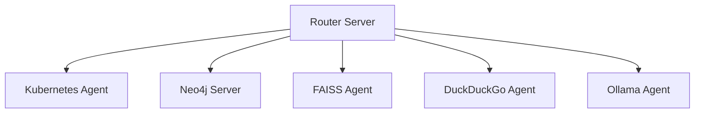

# MCP Flow

MCP Flow is a distributed system that implements the Model Context Protocol (MCP) to provide a flexible and extensible architecture for various AI and infrastructure management capabilities.

## Overview

The system consists of multiple specialized agents and servers that work together to provide:
- Kubernetes cluster management
- Vector similarity search (FAISS)
- Graph database operations (Neo4j)
- LLM interactions (Ollama)
- Web search capabilities (DuckDuckGo)
- Request routing and orchestration

## Architecture

The system follows a microservices architecture with the following components:



All services are containerized and managed through Docker Compose, with a base image (`mcp-base`) providing common dependencies.

## Components

### Router Server
- Central routing and orchestration component
- Handles request distribution and response aggregation
- Manages communication between different agents

### Kubernetes Agent
- Manages Kubernetes cluster operations
- Handles deployments, HPAs, CronJobs, and network resources
- Provides metrics collection and monitoring
- Supports configuration via kubeconfig

### Neo4j Server
- Manages graph database operations
- Provides graph data storage and querying capabilities
- Interfaces with Neo4j Community Edition database
- Exposes standard ports:
  - 7474: HTTP interface
  - 7687: Bolt protocol

### FAISS Agent
- Vector similarity search implementation
- Manages vector indices for efficient similarity lookups
- Persists indices for data continuity

### Ollama Agent
- Handles LLM interactions
- Manages local model deployments
- Provides inference capabilities

### DuckDuckGo Agent
- Implements web search functionality
- Includes caching for improved performance
- Manages rate limiting and request optimization

## Setup & Installation

### Prerequisites
- Python 3.12 or higher
- Docker and Docker Compose
- Kubernetes cluster (for K8s agent functionality)
- Neo4j credentials (default: neo4j/password)

### Installation

1. Clone the repository:
```bash
git clone <repository-url>
cd mcp-flow
```

2. Build and start the services:
```bash
docker-compose up --build
```

## Configuration

Each agent and server has its own configuration file (`config.yaml`) with specific settings:

### Kubernetes Agent Configuration
- Kubeconfig settings
- Resource management options
- Logging and metrics configuration
- Cache settings
- Security parameters

Similar configuration options are available for other agents in their respective `config.yaml` files.

## Development

### Project Structure
```
.
├── docker-compose.yml          # Service orchestration
├── Dockerfile.base            # Base image definition
├── pyproject.toml            # Python project configuration
├── kubernetes-agent/         # Kubernetes management
├── neo4j-server/            # Graph database operations
├── faiss-agent/            # Vector similarity search
├── ollama-agent/          # LLM interactions
├── duckduckgo-agent/     # Web search capabilities
├── routers-server/      # Request routing
└── utils/              # Shared utilities
```

### Dependencies
- duckduckgo-search: Web search functionality
- faiss-cpu: Vector similarity search
- kubernetes: K8s cluster management
- neo4j: Graph database operations
- ollama: LLM integration
- mcp[cli]: Model Context Protocol implementation
- Additional utilities: httpx, pydantic, python-dotenv, ruff

### Development Guidelines
1. Each agent/server is self-contained with its own:
   - Dockerfile for containerization
   - Configuration file
   - Core business logic
   - Logging and metrics collection

2. Common utilities are shared through the `utils/` directory:
   - Configuration management
   - Logging setup
   - Error handling
   - Metrics collection
   - Validation utilities

3. All services use standardized:
   - Logging formats (JSON)
   - Metric collection
   - Configuration structure
   - Error handling patterns

## License

[Add License Information]
